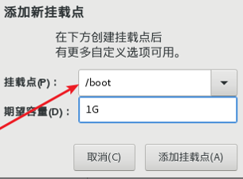
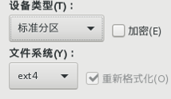
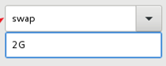
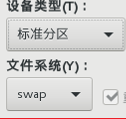
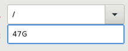
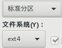
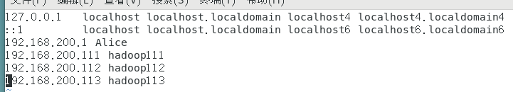
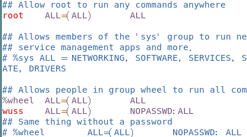

## 1. 准备虚拟机（最小化安装）




关闭KDUMP
开启网络
## 2. 配置一台纯净版模板机
### 2.1. 设置VM网络
### 2.2. 固定ip地址、修改主机名

```
vi /etc/sysconfig/network-scripts/ifcfg-ens33

修改
BOOTPROTO=static
添加
IPADDR=192.168.200.100
GATEWAY=192.168.200.2
DNS1=192.168.200.2
```
重启网络检查IP是否和设置的一样
`service network restart`
`ip addr`
测试网络
`ping www.baidu.com`
切换为root权限
修改ip与主机映射
`vi /etc/hosts`

### 2.3. 配置XShell
在windows中的`C:\Windows\System32\drivers\etc`路径下修改`hosts文件`的映射
连接XShell
### 2.4. 通过yum安装方式安装必要的软件
```shell
yum install -y epel-release
yum install -y psmisc nc net-tools rsync vim lrzsz ntp libzstd openssl-static tree iotop git
```
### 2.5. 关防火墙
```shell
systemctl stop firewalld
systemctl disable firewalld.service
```
### 2.6. 创建普通户用（wuss）并且提升它能拥有root权限
```shell
useradd wuss
passwd wuss
vim /etc/sudoers
```

修改/etc/sudoers 文件，在%wheel 这行下面添加一行，如下所示

### 2.7. 在Linux的/opt目录下创建 software 和 module
`mkdir /opt/module /opt/software` 
### 2.8. 将software 和 module 目录的所有者和所属组修改为 wuss
`chown wuss:wuss /opt/module /opt/software` 
### 2.9. 关机克隆